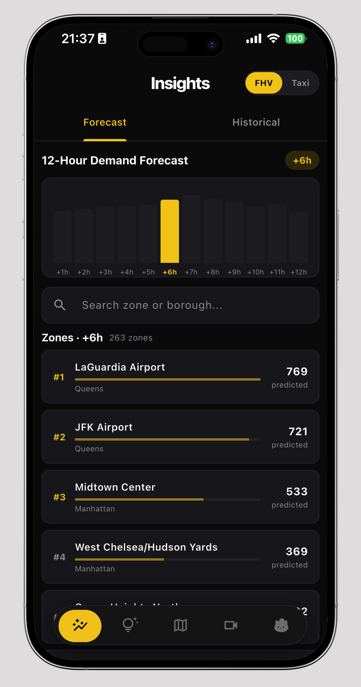
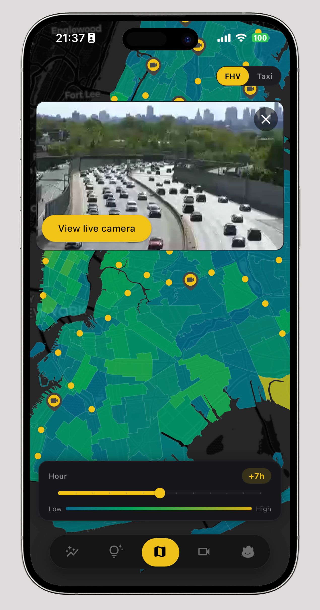
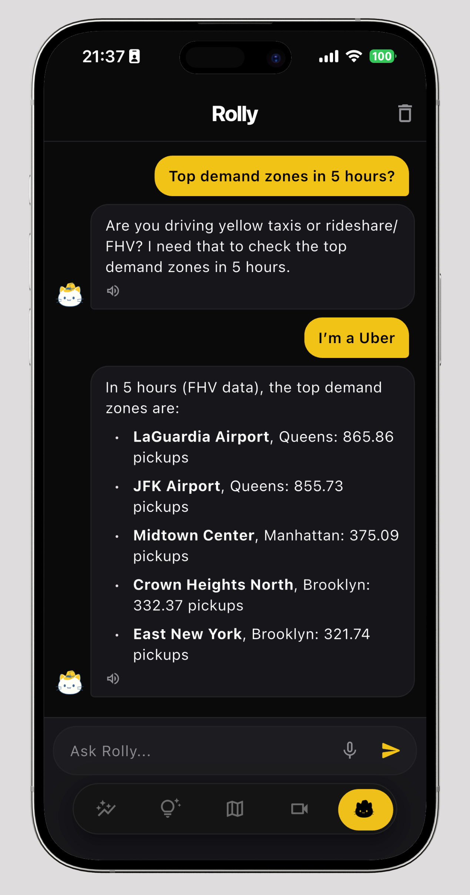

# museekar — NYC Taxi & Rideshare Analytics

Analysis and visualization platform for New York City taxi and rideshare trip data (Yellow, Green, FHVHV).
For drivers to find high-demand zones.

## What it does

- Temporal and geo-spatial analysis of NYC TLC trip records
- Demand heatmaps by zone and time
- Weather correlation with trip demand
- POI (Point of Interest) clustering
- POI density correlation by type with trip demand
- Viewing live camera and events in NYC

## Features
Here are some demos showing our app running:
<p float="left">
    
    
    
</p>

[Watch demo video](https://drive.google.com/file/d/1tQvYPqg3ZGzsrZ_ssqxDCedlxVNQYrSI/view?usp=share_link)

## Data sources

- [NYC TLC Trip Record Data](https://www.nyc.gov/site/tlc/about/tlc-trip-record-data.page) — Yellow, Green, FHVHV parquet files
- [Open-Meteo](https://open-meteo.com/) — historical weather
- [OpenStreetMap](https://www.openstreetmap.org/) — points of interest
- [NY511](https://data.ny.gov/Transportation/511-NY-Events-Beginning-2010/ah74-pg4w/about_data) — traffic event and camera data
- [NYC Rolling sales data](https://www.nyc.gov/site/finance/property/property-rolling-sales-data.page) - property sales in the last 12 months

## Project structure

```bash
    app/                 # flutter mobile app
    backend/             # fastapi endpoints
    scripts/             # cli etl pipelines
    src/
        analysis/        # Jupyter notebooks (yellow, green, fhvhv, geo, weather, wealth)
        model/           # demandPrediction and tipPrediction
    data/                # local only, gitignored
```

## Setup
Needs [docker](https://www.docker.com/) to run the backend service. \

### Usage
> [!WARNING]
> The backend service will crash if the datasets have not been properly
> downloaded and processed using the download scripts beforehand.

Get the weights for the prediction models from the latest release
and place them under:
```bash
    data/stgcn.keras         # taxi demand predictor
    data/stcgn_fhvhv.keras   # fhv demand predictor
    data/yellow_model/       # taxi tips pyspark prediction pipeline
```


To use "Rolly", our project's chatbot, spin up a LLM model locally on the same machine
as the backend service using [LM Studio](https://lmstudio.ai/)

Finally, the containers can be run like so using docker-compose:
```bash
docker compose up
```

### Developing
#### backend 
Uses Python >= 3.13. \
We recommend using [uv](https://github.com/astral-sh/uv) for dependecy management.
```bash
# core dependencies
uv sync

# for re-running some scripts and data download
uv sync --all-extras
```

#### frontend
Uses [Flutter](https://docs.flutter.dev/install)

In order to install dependencies for the app with flutter
```bash
flutter pub get
```
Run the app:
```bash
flutter run
```

### Running on iOS
> [!NOTE]
> iOS development requires a Mac with Xcode installed.

#### iOS Simulator

1. Install Xcode from the Mac App Store and accept the license:
   ```bash
   sudo xcodebuild -license accept
   ```
2. Install the iOS Simulator runtime (first time only):
   ```bash
   xcodebuild -downloadPlatform iOS
   ```
3. Open Simulator and boot a device:
   ```bash
   open -a Simulator
   ```
4. List available devices and run:
   ```bash
   flutter devices
   flutter run -d <simulator-id>
   ```

#### Physical iOS Device
1. Connect your iPhone via USB and **trust** the Mac when prompted on the device.
2. On iOS 16+, enable **Developer Mode** on the device:
   `Settings -> Privacy & Security -> Developer Mode -> On`
3. Open `app/ios/Runner.xcworkspace` in Xcode, go to **Signing & Capabilities**, select your Apple ID team, and let Xcode register the device automatically.
4. Install CocoaPods dependencies (first time only):
   ```bash
   cd app/ios && pod install && cd ../..
   ```
5. Run on the device:
   ```bash
   flutter devices
   flutter run -d <device-id>
   ```

## Pipelines
### Acquiring data
Certain Python scripts and example notebooks require specific datasets to run. 
Due to the large size of this data, it cannot be shared directly.

To test the code, please use the provided download script to retrieve the desired data, and adjust the corresponding paths within the notebooks.

There's a cli wrapper for calling download scripts.
> [!NOTE]
> Optional project dependencies group `download` is required to run.
```bash
uv run -m scripts.cli_download
```

### Transformations. Cleaning data
These scripts clean the datasets and write the output to the expected paths by the backend.

> [!NOTE]
> Optional project dependencies group `download` is required to run.
```bash
uv run -m scripts.data_transformations_yellow
uv run -m scripts.data_transformations_fhvhv
uv run -m src.aggregate_demand
```

## License
See [LICENSE](LICENSE).

## Credits
This project was developed as a University project by
- <https://github.com/AliciaPereda>
- <https://github.com/Beeing-Amazing>
- <https://github.com/Ch3ngJ>
- <https://github.com/tudouerr>
- <https://github.com/Yao-UCM>

Non-trivial code for the app frontend was written with the use of AI tools.
